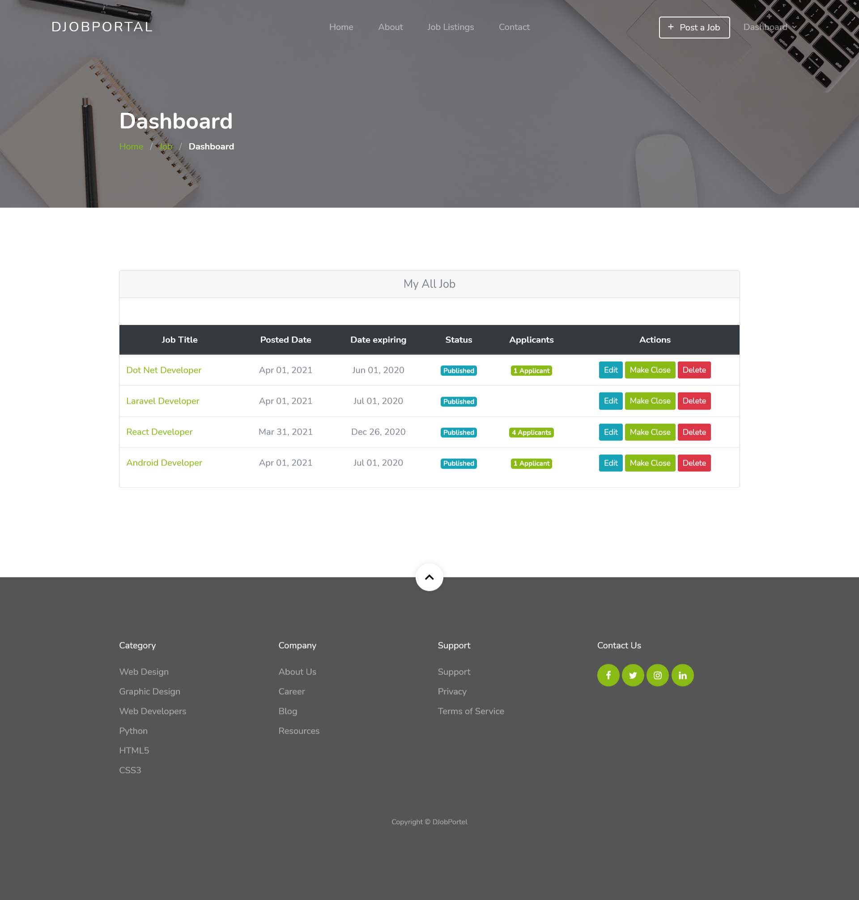
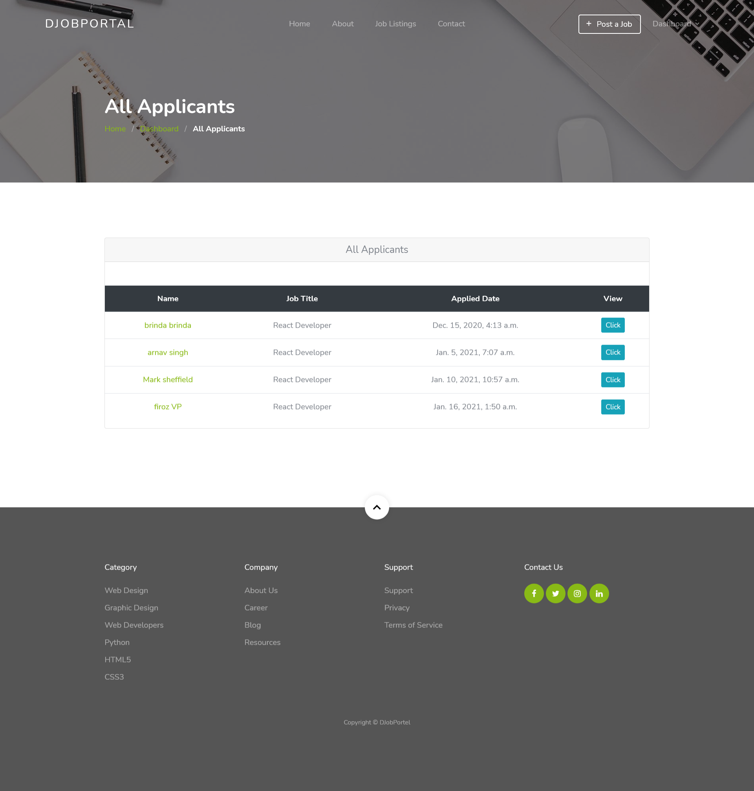
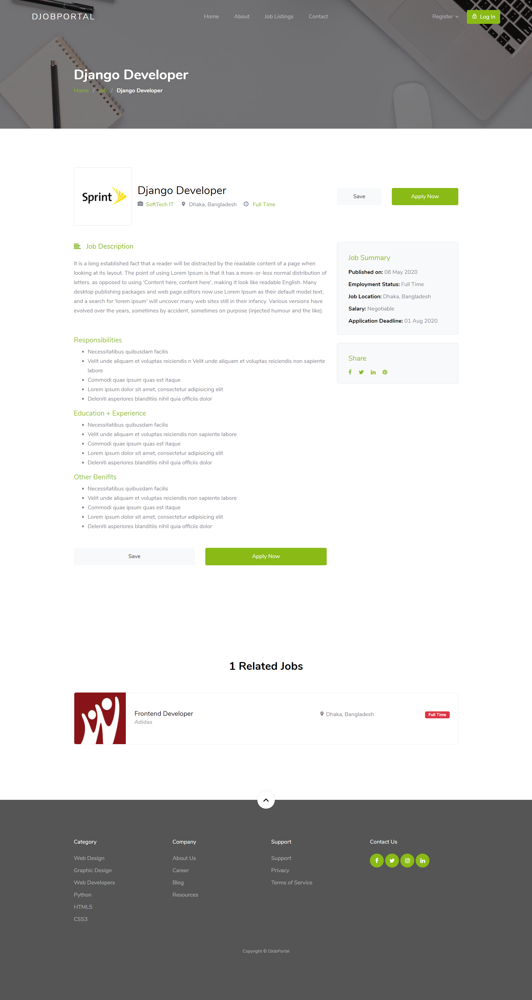
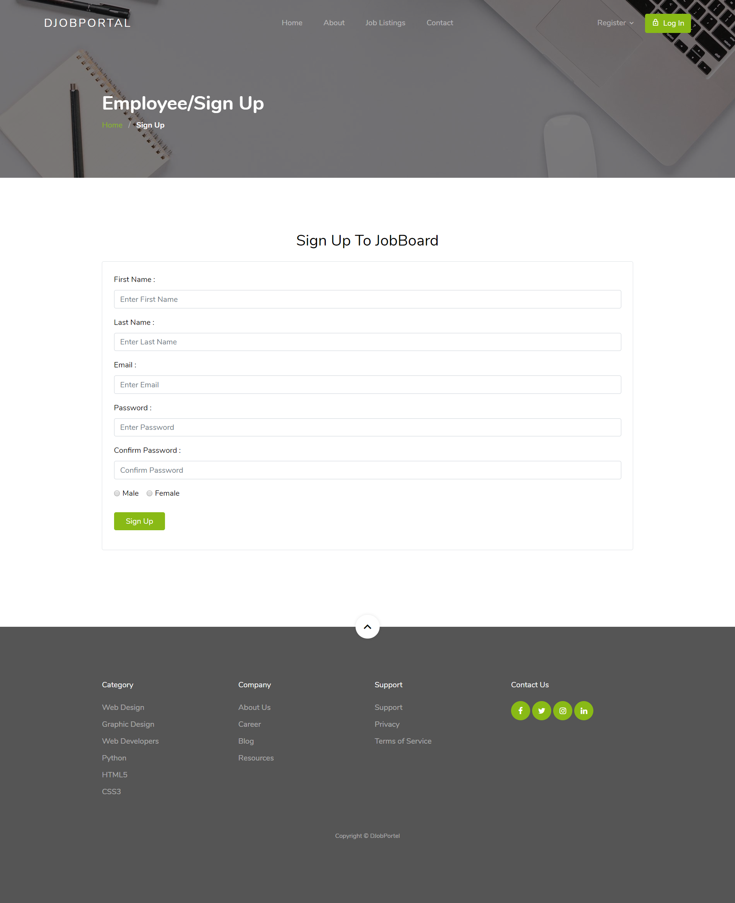
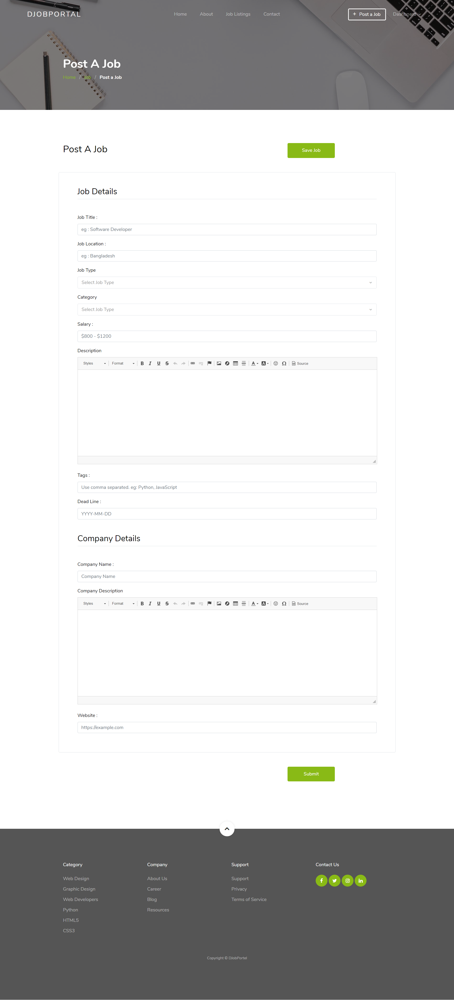
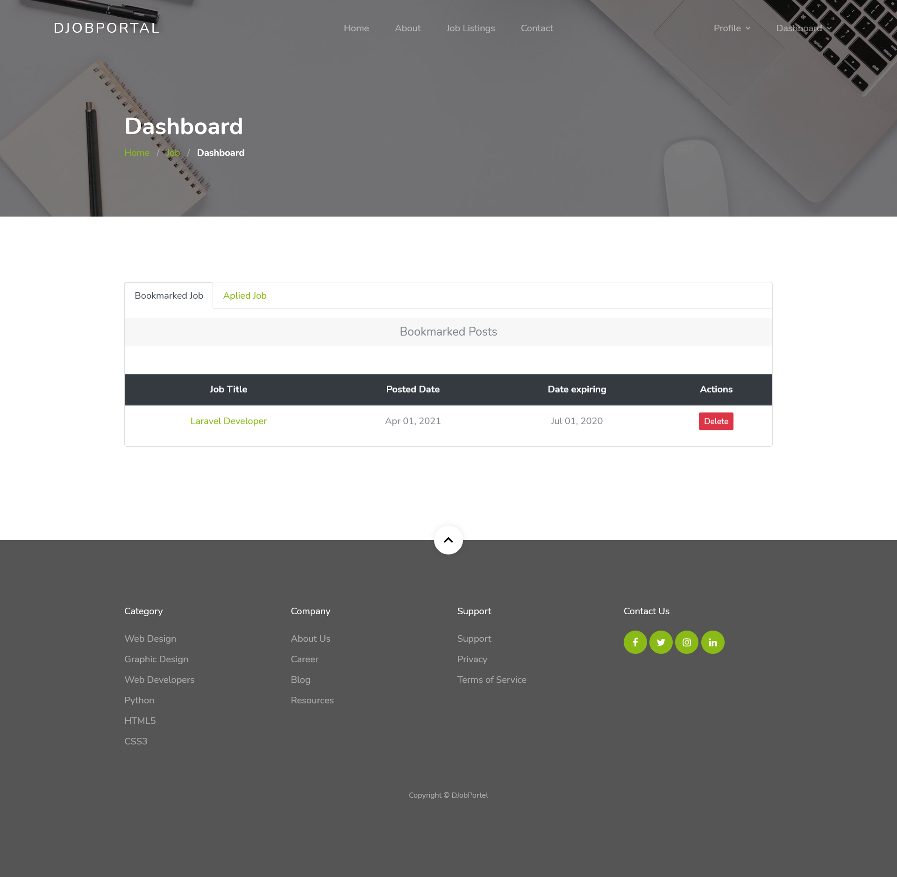
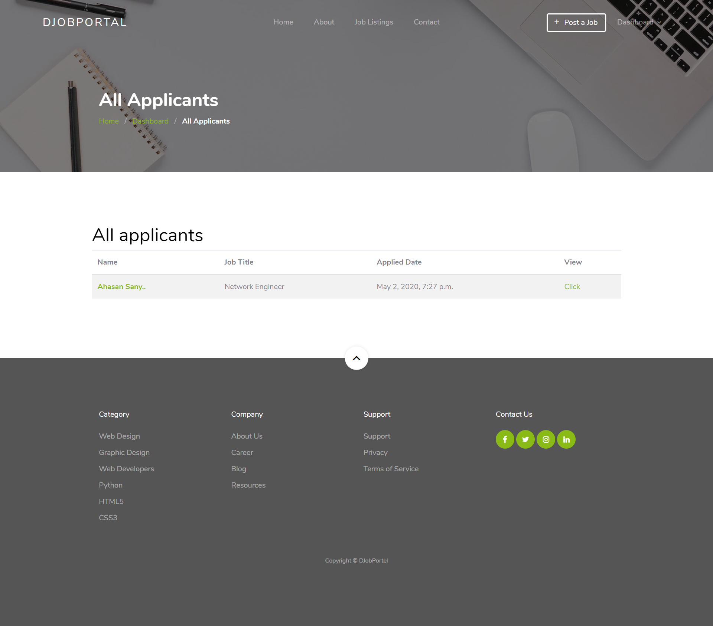
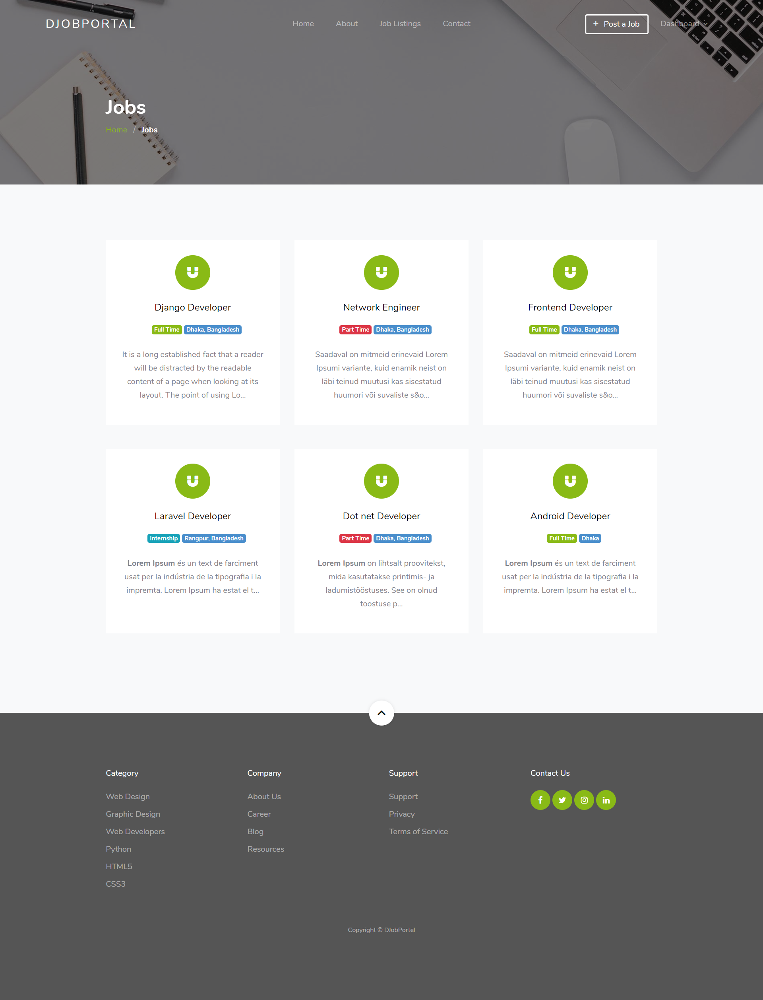
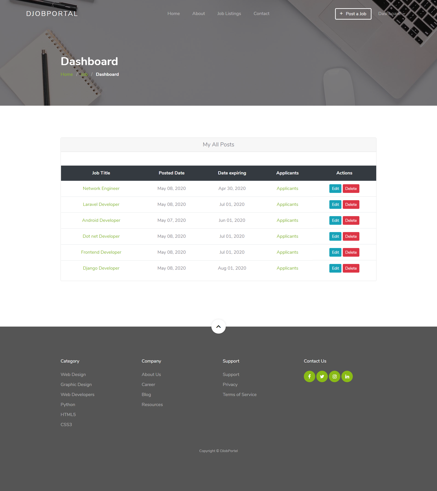
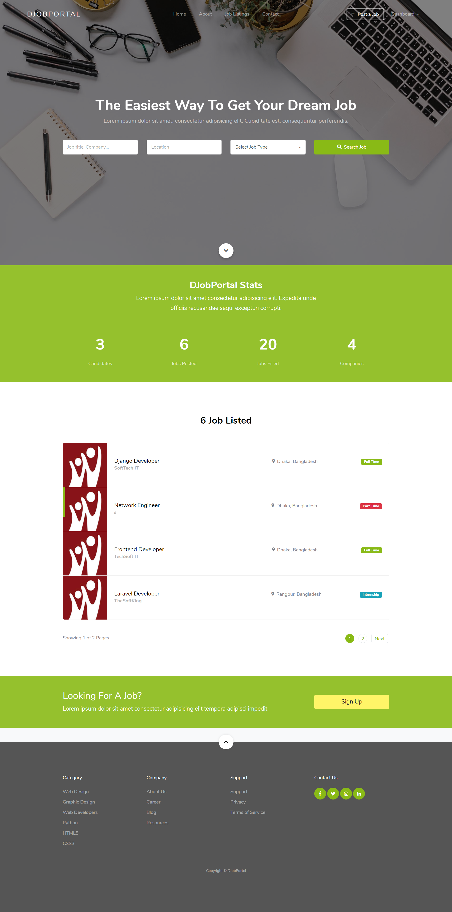

# Django Job Portal

A web-based job portal built with Django, allowing employers to post jobs and applicants to apply.

## Features

- Employer and applicant registration
- Job posting and management
- Application tracking
- Dashboard views for both employers and applicants

## Installation

1. **Clone the repository:**
    ```bash
    git clone https://github.com/Krut369/Job-Portal.git
    cd Job-Portal-Django
    ```

2. **Install dependencies:**
    ```bash
    pip install -r requirements.txt
    ```

3. **Configure the database:**
    - Edit `job/settings.py` to set your database credentials.

4. **Apply migrations:**
    ```bash
    python manage.py makemigrations
    python manage.py migrate
    ```

5. **Collect static files:**
    ```bash
    python manage.py collectstatic
    ```

6. **Run the development server:**
    ```bash
    python manage.py runserver
    ```

## Folder Structure

- `account/` – User authentication and management
- `jobapp/` – Job posting and application logic
- `screenshots/` – Example screenshots of the portal
- `static/` – Static assets (CSS, JS, images)
- `template/` – HTML templates

## Screenshots

Below are some screenshots of the portal UI:

| Dashboard | Applicants | Job Details | Register | Create Job |
|-----------|------------|-------------|----------|------------|
|  |  |  |  |  |

Additional views:

- 
- 
- 
- 
- 

## Author

- Krut369

## License

This project is licensed under the MIT License.

---

<div align="center">
    <h3>Thank You for using Django Job Portal!</h3>
</div>


